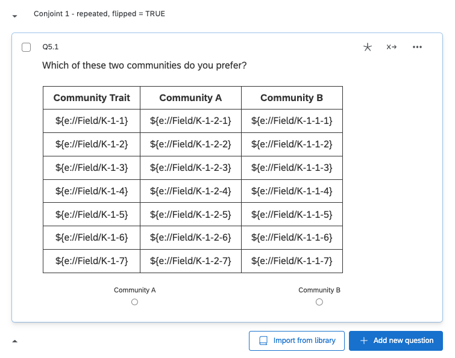

We are working on developing our own tools for building a conjoint survey in Qualtrics. In the meantime, we recommend using Anton Strezhnev's **Conjoint Survey Design Tool** (Link: [conjointSDT](https://github.com/astrezhnev/conjointsdt/)). Strezhnev's guide to designing and implementing conjoint surveys in Qualtrics is excellent and we will not reiterate it here. But to summarize: researchers should first design their conjoint study in ConjointSDT and produce a JavaScript file, which is then inputted into the first screen of your Qualtrics survey, using the Edit Question Javascript functionality. See the following screenshot as an example: 

{#id .class width=80% height=80%}

The above Javascript is available from [here](https://raw.githubusercontent.com/yhoriuchi/projoint/master/data-raw/example.js).

The JavaScript produced by ConjointSDT will run internally within Qualtrics and automatically creates the values for *embedded fields*. These are the attributes and levels that constitute the profile pairs of each conjoint task. For example, embedded field "K-1-1-7" contains the value (level) of the seventh attribute for the first profile (of two) in the first task, and "K-5-2-5" contains the level of the fifth attribute for the second profile (of two) in the fifth task. 

What you should do is to design, for each task, a table using HTML and insert these embedded fiels. The following is the screenshot of the first task in our example. 

{#id .class width=80% height=80%} 

The complete HTML for the first conjoint task in this survey is available from [here](https://raw.githubusercontent.com/yhoriuchi/projoint/master/data-raw/task_first.html):

A typical conjoint study will include five to ten tasks. The number of questions with such HTML pages should correspond to the number of tasks. The embedded fields in each task are different: The first digit after the "K" will increment from 1 to 10 as the tasks progress.

If we wish to implement *a repeated task*, then, all we need to do is copy the task to be repeated (say, the first task) to a later point in the survey (say, after the fifth task). We recommend that researchers *flip the order* of the two profiles as well. Therefore, Profile 1 in the original task becomes Profile 2 in the new task. To do this, we would simply swap the middle digit of the embedded fields as below.

The repeated task will then look like the following:
{#id .class width=80% height=80%}

The complete HTML for the first conjoint task in this survey is available from [here](https://raw.githubusercontent.com/yhoriuchi/projoint/master/data-raw/task_repeated.html):

With the repeated task, researchers can use to measure intra-respondent reliability (IRR).

For more information about [conjointSDT](https://github.com/astrezhnev/conjointsdt/), see Strezhnev's detailed instructions. 

If you want to copy the Qualtric survey that we designed for our exmaple, download the QSF file below and import it to your Qualtrics account. You can then use it as a template to design your own conjoint survey experiment! 

```{r}
library(downloadthis)

## Link in Github repo
download_link(
  link = "https://raw.githubusercontent.com/yhoriuchi/projoint/master/data-raw/CHKKK_Mummolo_and_Nall_full_replication_W1_Lucid_-_August_2021.qsf",
  button_label = "Download QSF file",
  button_type = "danger",
  has_icon = TRUE,
  icon = "fa fa-save",
  self_contained = FALSE
)

```


