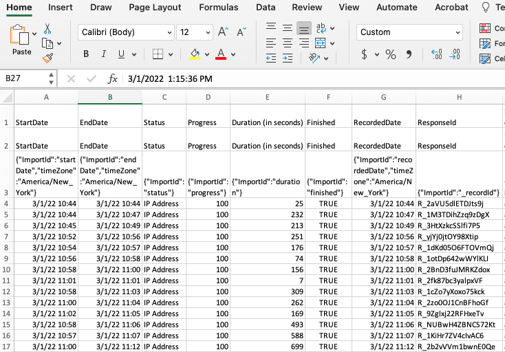

Projoint is a complete pipeline for conjoint survey design, implementation, analysis, and visualization. This R library conducts the data wrangling, measurement error correction, and statistical analysis components. Most users will only encounter two main functions -- `reshape_projoint()` and `projoint()` -- while more advanced users will have a high degree of control over the mechanics of their estimation.

The `projoint()` function takes a number of inputs: 
1. an argument specifying the data
2. an argument set specifying the measurement error correction method
3. an argument indicating the standard error estimation method
4. optional arguments specifying the structure of the analysis and quantities of interest

As well, there are arguments allowing users to step through these analysis decisions more slowly. We include a function to read the results of a conjoint survey from a Qualtrics csv, a function to estimate measurement error, functions to restructure conjoint data according to specific quantities of interest, and several visualization functions to produce publication-ready plots.

To start, let's use `read_Qualtrics()` to load in a data set. We'll use an example data set that replicates a study by [Mummolo and Nall (2017)](https://doi.org/10.1086/687569) examining residential segregation in the United States. We replicate this study exactly, except for adding in an extra question we can use to estimate measurement error. 

When you download a file from Qualtrics, please make sure to "use choice text" (for more instructions by Qualtrics, see [Data Export Options](https://www.qualtrics.com/support/survey-platform/data-and-analysis-module/data/download-data/export-options/)). Please note that the original Qualtrics file has three rows to describe variables. Thus, it should look like the following:

{#id .class width=100% height=100%}

The `read_Qualtrics()` function uses the first row as the column names and skip the second and third rows. 

```{r, eval=FALSE}
library(projoint)
dat <- read_Qualtrics("data/mummolo_nall_replication.csv")
```

```{r, eval=TRUE, echo=FALSE, message=FALSE, warning=FALSE}
library(projoint)
data_file <- system.file("extdata", "mummolo_nall_replication_cleaned.csv", package = "projoint")
if (data_file == "") stop("File not found!")
dat <- read_Qualtrics(data_file)
```

After reading the Qualtrics data into R, you perhaps need to add a few more lines to clean your data -- e.g., removing incomplete responses, filtering out respondents who failed to pass the attention check questions, some responses that Qualtrics flagged as possible bots, etc. Then, your data frame (more specifically, tibble) should look like the following. Each row corresponds to each respondent. 

```{r, echo = FALSE}
dat
```


Next, we will use `reshape_projoint()` to prepare the data set for the main function. This involves stripping unnecessary columns, indicating which column (if any) is a repeated task, and specifying the respondent identifier.

```{r, eval=TRUE}
reshaped_data <-  reshape_projoint(
  .dataframe = dat, 
  .outcomes = c(paste0("choice", 1:8), "choice1_repeated_flipped"),
  .outcomes_ids = c("A", "B"),
  .alphabet = "K", 
  .idvar = "ResponseId", 
  .repeated = TRUE,
  .flipped = TRUE)

```

Let's walk through the arguments we have specified. `.dataframe` is a data frame, ideally read in from Qualtrics using `read_Qualtrics()` but not necessarily. The `.idvar` argument, a character, indicates that in `exampleData1`, the column `ResponseId` indicates unique survey respondents. The `.outcomes` variable lists all the columns that are outcomes; the last element in this vector is the repeated task (if it was conducted). `.outcomes_ids` indicates the possible options for an outcome; specifically, it is a vector of characters with two elements, which are the last characters of the names of the first and second profiles. For example, it should be c("A", "B") if the profile names are "Candidate A" and "Candidate B". This character vector can be anything, such as c("1", "2"), c("a", "b"), etc. *If you have multiple tasks in your design, you should use the same profile names across all these tasks*. `.alphabet` defaults to "K" if the conjoint survey was conducted using either our tool or Strezhnev's [Conjoint Survey Design Tool](https://github.com/astrezhnev/conjointsdt). The final two arguments, `.repeated` and `.flipped`, again relate to the repeated task. If the `.repeated` is set to `TRUE`, then the last element of the `.outcomes` vector is taken to be a repetition of the first task; `.flipped` indicates whether the profiles are in the reversed order.

We can pass this data set directly into `projoint()` as follows: 

```{r, eval=TRUE}
output <- projoint(reshaped_data)
```
To see the key components of the estimate, use `print()`:
```{r}
print(output)
```
To see the summary of the estimated results, use `summary()`:
```{r}
summary(output)
```
The `summary()` returns a tibble (the tidyverse version of data frame). So researchers can save and use it to make tables and figures. For those who want to skip this manual step and plot the estimates, use `plot()`, but please note that the current version only shows the figure for profile-level MMs or AMCEs.
```{r, eval=TRUE, fig.height=8, fig.width=8}
plot(output)
```